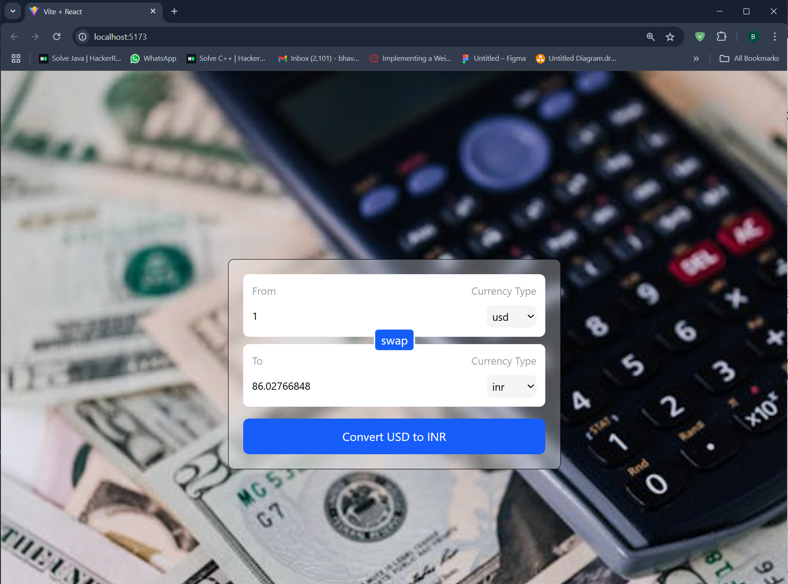

# Currency Converter
### A simple and efficient Currency Converter built with React.js, designed to fetch real-time exchange rates and provide seamless currency conversion.

## Features

* Live Currency Rates: Fetches real-time exchange rates using an API.

* Two-Way Conversion: Easily swap between currencies.

* Minimal & Responsive UI: Clean design with Tailwind CSS.

* Optimized Performance: Built with Vite for fast bundling.

## Tech Stack

* Frontend: React + Vite, Tailwind CSS

* API Integration: Fetch API

* useCallback – Optimized functions for better performance.

* useEffect – Dynamically updated the currency rate based on user preferences.

## Demo


## Installation & Setup

### Clone the repository
```
git clone https://github.com/yourusername/password-generator.git
cd password-generator
```
### Install dependencies
```
npm install
```
### Run the development server
```
npm run dev
```
### Open http://localhost:5173 in your browser to see the app.